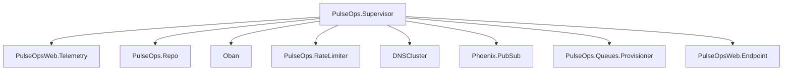

# Supervision Tree

## Notes

- `Oban` owns queue processes, schedulers, and the pruner plugin.
- `PulseOps.Queues.Provisioner` only coordinates queue runtime shape; it does not execute jobs itself.
- `PulseOpsWeb.Telemetry` publishes Prometheus-compatible metrics and periodic queue depth measurements.
