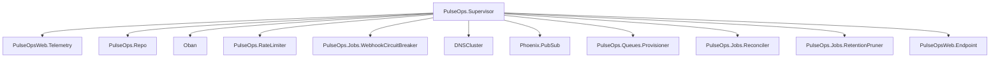

# Supervision Tree

## Notes

- `Oban` owns queue processes, schedulers, and the pruner plugin.
- `PulseOps.Queues.Provisioner` only coordinates queue runtime shape; it does not execute jobs itself.
- `PulseOps.Jobs.Reconciler` repairs platform jobs that remain `running` after Oban has already reached a terminal state.
- `PulseOps.Jobs.RetentionPruner` removes terminal job history after the tenant retention window.
- `PulseOps.Jobs.WebhookCircuitBreaker` isolates repeated webhook destination failures from the rest of the worker system.
- `PulseOpsWeb.Telemetry` publishes Prometheus-compatible metrics and periodic queue depth measurements.

## Architectural Direction

- Process supervision should restart infrastructure processes such as telemetry, queue provisioning, reconciliation, retention pruning, and circuit breaking.
- Domain failures should not crash the supervision tree. They should become `job_attempts`, `job_events`, metrics, and alerts.
- Worker retries should be owned by Oban, while public lifecycle state should be mirrored into PulseOps tables.
- Manual replay should be modeled as an explicit domain operation before it is automated as a background process.
