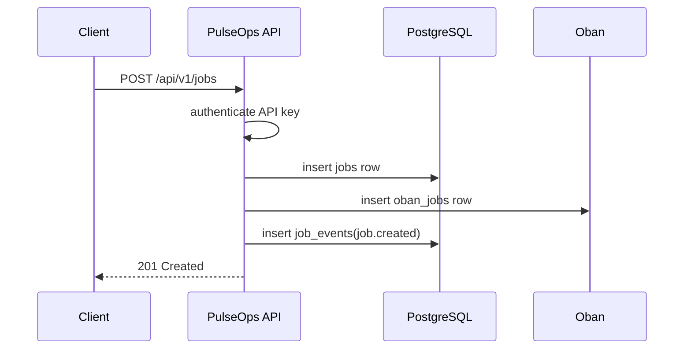
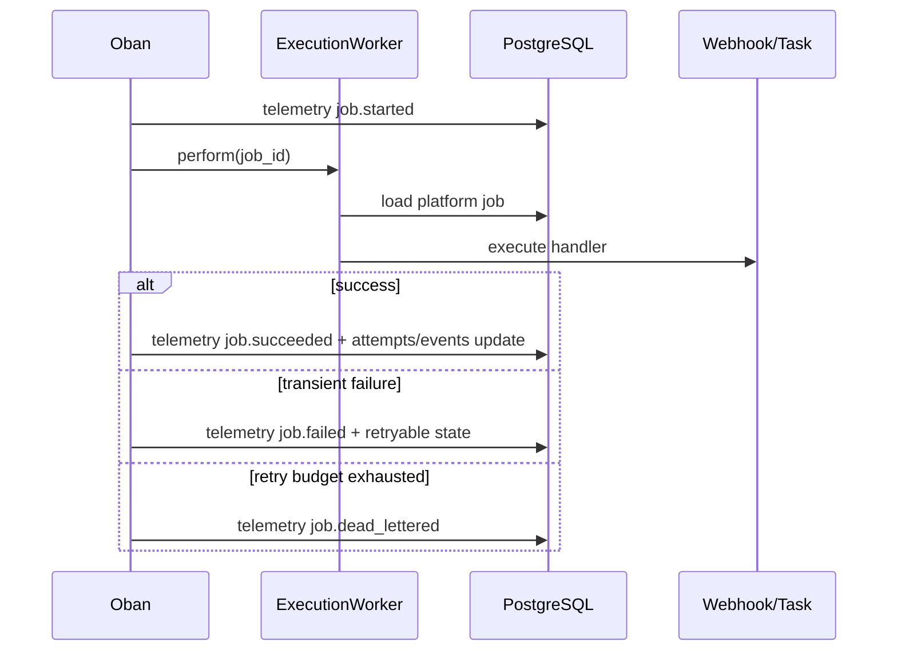

# Request and Worker Flows

## Enqueue flow

```mermaid
sequenceDiagram
  participant Client
  participant API as PulseOps API
  participant DB as PostgreSQL
  participant Oban

  Client->>API: POST /api/v1/jobs
  API->>API: authenticate API key
  API->>DB: insert jobs row
  API->>Oban: insert oban_jobs row
  API->>DB: insert job_events(job.created)
  API-->>Client: 201 Created
```

## Execution flow

```mermaid
sequenceDiagram
  participant Oban
  participant Worker as ExecutionWorker
  participant DB as PostgreSQL
  participant Target as Webhook/Task

  Oban->>DB: telemetry job.started
  Oban->>Worker: perform(job_id)
  Worker->>DB: load platform job
  Worker->>Target: execute handler
  alt success
    Oban->>DB: telemetry job.succeeded + attempts/events update
  else transient failure
    Oban->>DB: telemetry job.failed + retryable state
  else retry budget exhausted
    Oban->>DB: telemetry job.dead_lettered
  end
```
