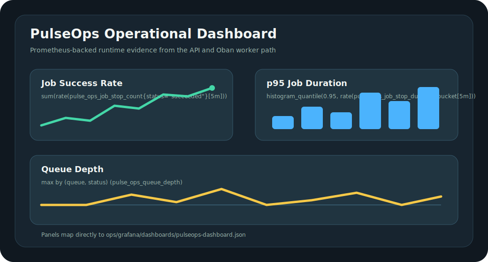

# Observability Evidence

This page captures the runtime signals an evaluator can verify without reading
the implementation first. The samples below were captured from `make demo` on
2026-05-29.

## Demo Evidence

`make demo` exercises the API and worker path end to end:

```text
Creating tenant: demo-1780054847
Enqueueing job...
Waiting for job completion: 94838202-31e3-45e1-9c70-9db9fd0d08b5
Final job status: succeeded
Lifecycle events:
- job.created: queued
- job.started: running
- job.succeeded: succeeded
Demo completed successfully.
```

## Metrics Evidence

The demo samples `/metrics` after the job reaches a terminal state:

```text
# HELP pulse_ops_job_stop_duration End-to-end execution time for background jobs
# TYPE pulse_ops_job_stop_duration histogram
pulse_ops_job_stop_duration_bucket{queue="default",status="succeeded",worker="PulseOps.Jobs.ExecutionWorker",le="50"} 1
pulse_ops_job_stop_duration_sum{queue="default",status="succeeded",worker="PulseOps.Jobs.ExecutionWorker"} 27.677
pulse_ops_job_stop_duration_count{queue="default",status="succeeded",worker="PulseOps.Jobs.ExecutionWorker"} 1
# HELP pulse_ops_job_stop_count
# TYPE pulse_ops_job_stop_count counter
pulse_ops_job_stop_count{queue="default",status="succeeded",worker="PulseOps.Jobs.ExecutionWorker"} 1
# HELP pulse_ops_job_created_count
# TYPE pulse_ops_job_created_count counter
pulse_ops_job_created_count{queue="default",worker="noop"} 1
```

These are the signals used by the Grafana dashboard:

- `pulse_ops_job_stop_count`: successful jobs per second
- `pulse_ops_job_stop_duration_bucket`: p95 execution duration
- `pulse_ops_queue_depth`: queue backlog by queue and status

## Alert Evidence

Prometheus alert rules are checked in at
[`ops/prometheus/alerts.yml`](../../ops/prometheus/alerts.yml). They cover:

- sustained HTTP 5xx rate
- high queued job depth
- elevated dead-letter rate
- high p95 job execution duration

## Structured Log Evidence

The dev logger includes request and domain metadata. A worker completion log
contains the correlation ID, organization ID, job ID, and queue:

```text
08:40:47.237 correlation_id=027a83e1-6f0a-413c-8a98-9d0d27f9b8de organization_id=42d217a7-78d8-4d11-9bfe-91661f654b3a job_id=94838202-31e3-45e1-9c70-9db9fd0d08b5 queue=default [debug] QUERY OK source="jobs" db=0.9ms
```

HTTP logs also include request and correlation IDs:

```text
08:40:47.176 request_id=GLQGc86kZAr0su4AAAAo correlation_id=GLQGc86kZAr0su4AAAAo [info] POST /api/v1/jobs
08:40:47.198 request_id=GLQGc86kZAr0su4AAAAo correlation_id=GLQGc86kZAr0su4AAAAo organization_id=42d217a7-78d8-4d11-9bfe-91661f654b3a [info] Sent 201 in 22ms
```

## Dashboard Evidence

The Grafana dashboard is checked in at
[`ops/grafana/dashboards/pulseops-dashboard.json`](../../ops/grafana/dashboards/pulseops-dashboard.json).
It contains panels for job success rate, p95 job duration, and queue depth.



The preview above is a repository-native rendering of the dashboard shape. To
run the real dashboard locally:

```bash
docker compose up -d postgres app prometheus grafana
open http://localhost:3000
```
